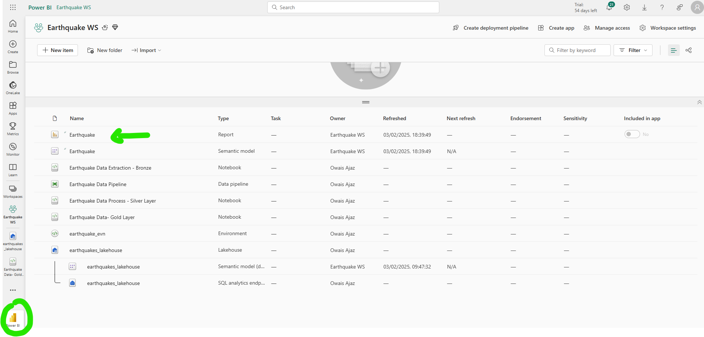

# Azure Fabric Earthquake Data Pipeline

## 📌 Overview
This project implements a **data pipeline** using **Microsoft Azure Fabric** to process earthquake data from the **US Earthquake API**. The solution follows **Medallion Architecture**, utilizes **Delta Tables & lakehouse**, and provides real-time insights via **Power BI** dashboards.

## 🚀 Architecture
- **Data Source**: US Earthquake API 
- **Processing**: PySpark Notebooks
- **Storage**: **Delta Tables & Lakehouse Storage** (Bronze → Silver → Gold)
- **Orchestration**: Azure Fabric **Data Pipeline**
- **Visualization**: SQL Endpoint for **Power BI Dashboards**

## 📖 API Documentation
For more details, visit the [US Earthquake API](https://earthquake.usgs.gov/fdsnws/event/1/query?format=geojson&starttime=<start_date>&endtime=<end_date>).

## 🔹 Features
✅ **Lakehouse Architecture** for scalable data storage  
✅ **Medallion Architecture** for structured data refinement  
✅ **Merge Strategy** for incremental updates  
✅ **Delta Tables** for ACID compliance & fast queries  
✅ **SQL Endpoint** for direct Power BI integration  

## 🛠️ Tech Stack
- **Azure Fabric** (Lakehouse, Data Pipeline, SQL Endpoint)
- **PySpark** for data transformation
- **Delta Lake** for efficient storage
- **Power BI** for visualization

## 📂 Data Processing Flow
1️⃣ **Bronze Layer** → Stores raw earthquake data  
2️⃣ **Silver Layer** → Cleans & transforms data  
3️⃣ **Gold Layer** → Provides aggregated insights  

## 📊 Power BI Dashboard
- 🌎 **Earthquake Monitoring**

